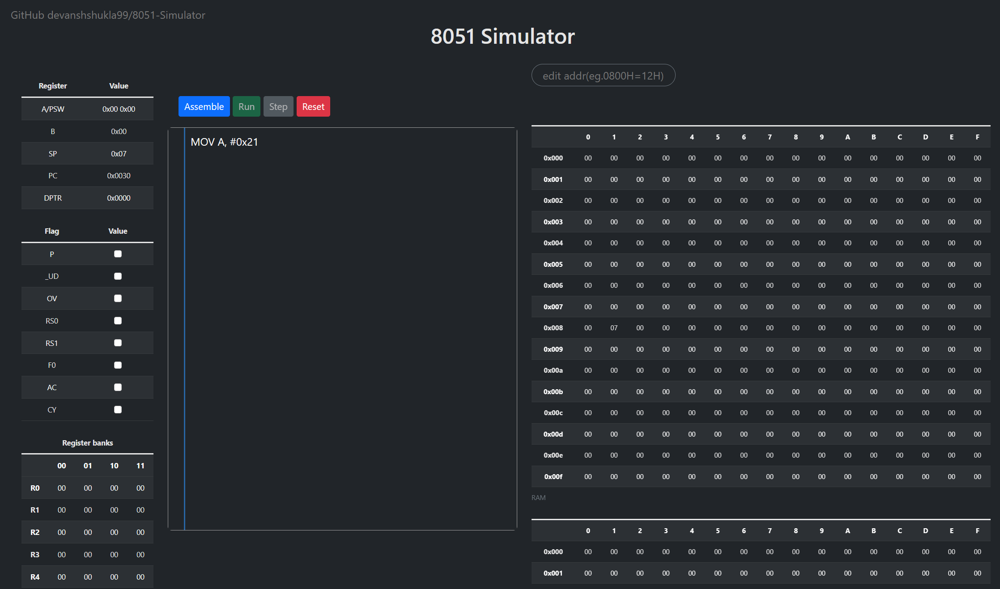

==============
8051 Simulator
==============

|build| |license|

A project for python based 8051 microprocessor simulator

Deployed at `8051 Simulator <https://sim8051.pythonanywhere.com/>`_

---------------------------------------

Usable opcodes
--------------

The following opcodes are usable presently:

- ADD
- ANL
- CJNE
- CLR
- CPL
- DA
- DEC
- DJNZ
- INC
- JC
- JNC
- JNZ
- JZ
- MOV
- ORG
- ORL
- POP
- PUSH
- RL
- RR
- SETB
- SUBB
- SJMP
- AJMP
- LJMP
- JMP
- JBC

.. |build| image:: https://github.com/devanshshukla99/8051-Simulator/actions/workflows/build.yml/badge.svg
    :target: https://github.com/devanshshukla99/8051-Simulator/actions/workflows/build.yml
    :alt: build
.. |license| image:: https://img.shields.io/badge/license-MIT-blue.svg
    :alt: License
